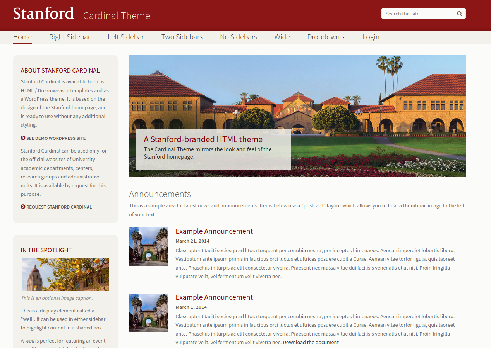
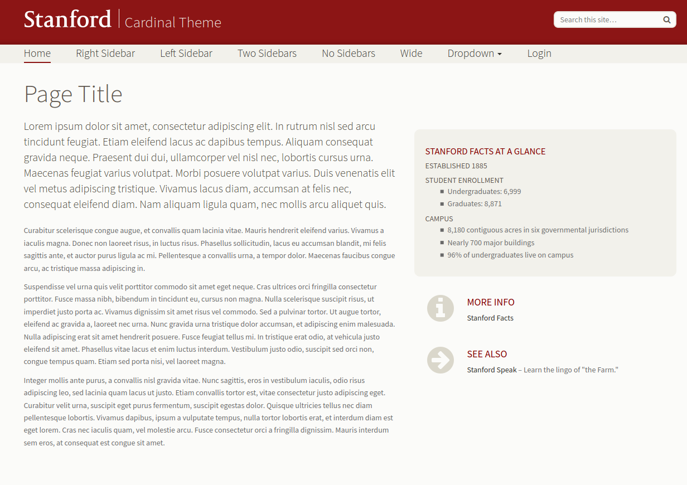
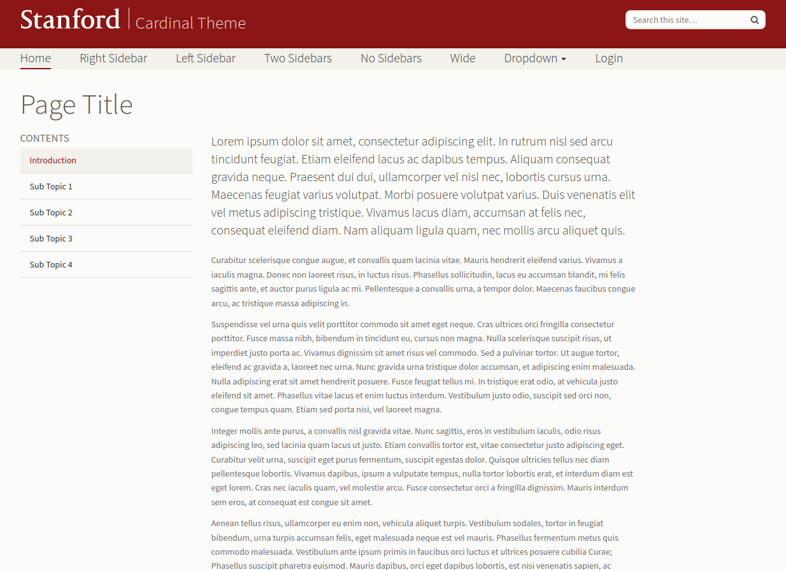
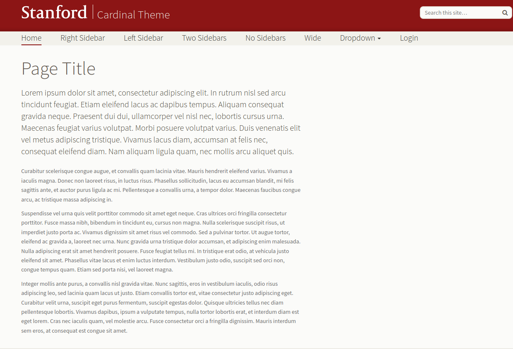
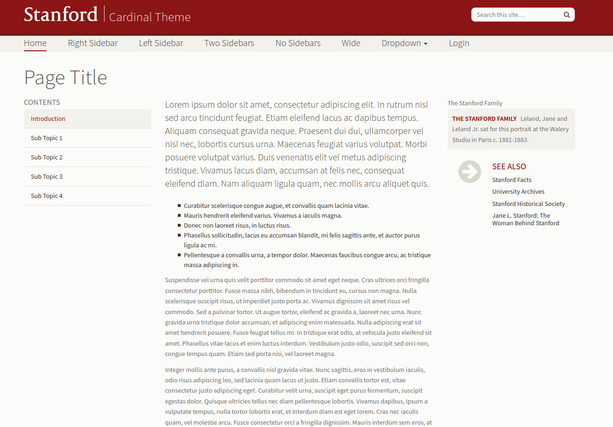
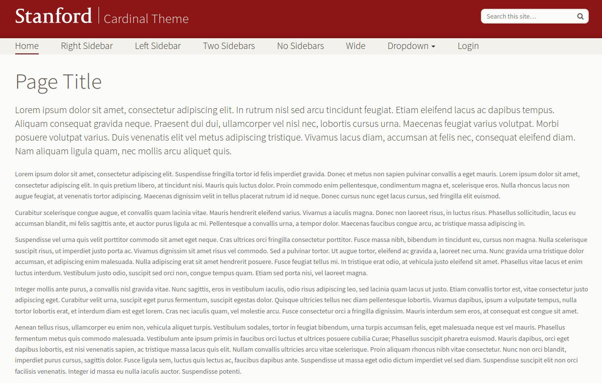
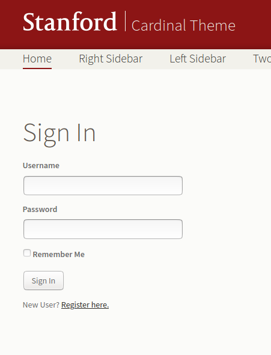
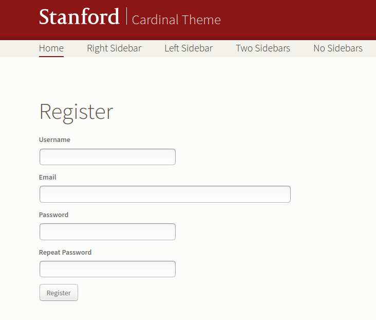

# GCP Flask + Stanford Starter Template


> Google Cloud Project Flask + Stanford Starter Template

You might want to quickly deploy an application to show off your analysis, paper,
or even create a programmatic RestFul API for others to use. You should need
to start from scratch to do this! Brought to you by [Research Software Engineering Services](https://stanford-rc.github.io/rse-services),
these free-to-use templates will get you started with a solid base for your development.

This particular teplate will get you started to deploy a Flask application
on [Google App Engine](https://cloud.google.com/appengine/docs/standard/python3/building-app/writing-web-service)! 
The template includes:

 - several branded themes to choose from
 - a basic user and registration model
 - a restful API example
 - several database options, sqlite, postgres and mysql
 - examples of testing for your code

**under development** - this README will be converted to beautiful online docs!

## Getting Started

### Setup

You will want to follow the instructions [here](https://cloud.google.com/appengine/docs/standard/python3/building-app/writing-web-service)
and:

 - create a Google Cloud Project, you can request one at Stanford [here](https://stanford.service-now.com/it_services?id=sc_cat_item&sys_id=fa9f80bddbf05b401df130cf9d96198b)
 - install the gcloud command line client and Python3+
 - authenticate on the command line with `gcloud auth application-default login`

For example, after I've created my project and I've installed gcloud, I might login and
then set the default project to be my new project:

```bash
$ gcloud auth application-default login
$ gcloud config set project <myproject>
```

### Config

In the [config.py](config.py) file, you can define as many or
as few of the custom variables (e.g., a Twitter alias) as you like. These are
rendered in various pages by default. You can also choose to disable authentication
with `disable_auth = True`.

### Development

To develop locally, you'll want to create a local environment and then install
dependencies to it.

```bash
python -m venv env
source env/bin/activate
pip install  -r requirements.txt
```

Then you will want to copy the .example-env file to .env, populate it with your secrets,
and source it:

```bash
source .env
```

And then to run the application locally, issue this command:

```bash
python main.py
```

And then you can open up your browser to [http://localhost:8080](http://localhost:8080).

**under development**

### Templates

The gcp flask application provides several templates and examples for you to start work
for your project! If you need any help, please don't hesitate to [open an issue](https://github.com/stanford-rc/gcp-flask-stanford/issues)
or reach out to [Research Software Engineering Services](https://stanford-rc.github.io/rse-services/contact).


#### Cardinal Theme

The [Stanford Cardinal Theme](http://web.stanford.edu/group/webdev/cardinal/) provides you with standard views for:

**home**



**right sidebar**



**left sidebar**



**no sidebars**



**two sidebars**



**wide**




Along with login and registration views.

**login**



**register**




### Deployment

The instructions here will show you how to deploy on Google App Engine (not written yet).

## Extra Features

The following extra features might be useful to you, and if you would like help to develop
them for your application, please reach out to [Research Software Engineering Services](https://stanford-rc.github.io/rse-services/).

 - **Custom Search** of pages or models (the current search goes to Stanford search)
 - **Social Authentication** for login with social identities such as Twitter, Google, Globus, etc.
 - **SAML authentication** for more specific Stanford-only access.
