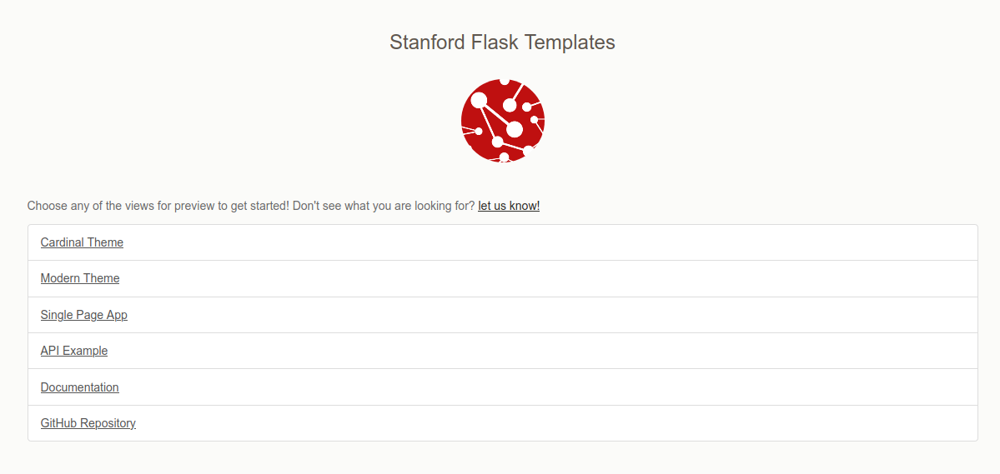

# GCP Flask + Stanford Starter Template

> Google Cloud Project Flask + Stanford Starter Template

You might want to quickly deploy an application to show off your analysis, paper,
or even create a programmatic RestFul API for others to use. You should not need
to start from scratch to do this! Brought to you by [Research Software Engineering Services](https://stanford-rc.github.io/rse-services),
these free-to-use templates will get you started with a solid base for your development.

This particular teplate will get you started to deploy a Flask application
on [Google App Engine](https://cloud.google.com/appengine/docs/standard/python3/building-app/writing-web-service)! 
The template includes:

 - several branded themes to choose from
 - a basic user and registration model
 - a restful API example
 - several database options, sqlite, postgres and mysql
 - examples of testing for your code

## Getting Started

You can jump in to the [documentation](https://stanford-rc.github.io/gcp-flask-template) to
get started. If you have any requests for features or questions, please don't hesitate
to [open an issue](https://www.github.com/stanford-rc/gcp-flask-template/issues).

## Extra Features

The following extra features might be useful to you, and if you would like help to develop
them for your application, please reach out to [Research Software Engineering Services](https://stanford-rc.github.io/rse-services/).

 - **Custom Search** of pages or models (the current search goes to Stanford search)
 - **Social Authentication** for login with social identities such as Twitter, Google, Globus, etc.
 - **SAML authentication** for more specific Stanford-only access.
